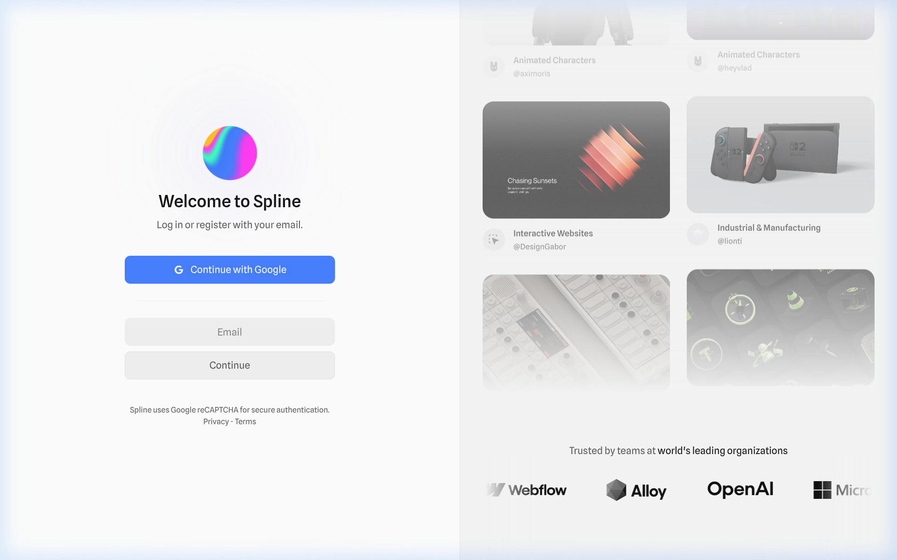
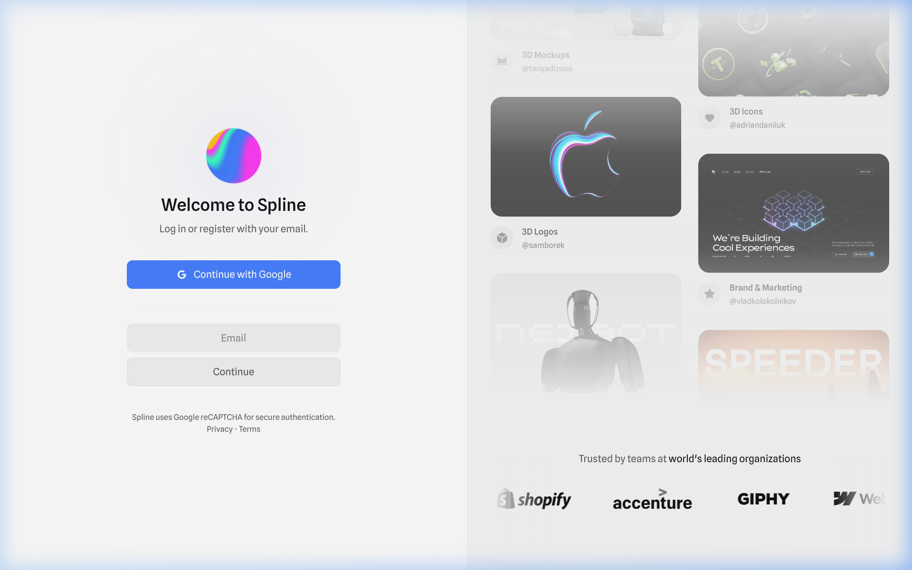

# Spline Login Page — 1:1 Design Specification

> Complete design spec for replicating the Spline sign-in page. The **hero/right panel content** is a placeholder — only layout and card styles are specified.

---

## Reference Screenshots





---

## 1. Page Layout

```
┌─────────────────────────────────────────────────────────────────────┐
│                         100vw × 100vh                               │
│ ┌──────────────────────────┐ ┌──────────────────────────────────┐   │
│ │                          │ │                                  │   │
│ │     LEFT PANEL (50%)     │ │      RIGHT PANEL (50%)           │   │
│ │         #FFFFFF          │ │        #F5F5F5                   │   │
│ │                          │ │                                  │   │
│ │   ┌──────────────────┐   │ │  ┌─────────┐  ┌─────────┐      │   │
│ │   │    Logo Sphere   │   │ │  │  Card 1  │  │  Card 2  │     │   │
│ │   │     (80×80)      │   │ │  │ (Large)  │  │ (Small)  │     │   │
│ │   └──────────────────┘   │ │  └─────────┘  └──────────┘      │   │
│ │   "Welcome to Spline"   │ │  ┌─────────┐  ┌──────────┐      │   │
│ │   "Log in or register"  │ │  │  Card 3  │  │  Card 4  │     │   │
│ │                          │ │  │ (Small)  │  │ (Large)  │     │   │
│ │   [Continue with Google] │ │  └─────────┘  └──────────┘      │   │
│ │   ─── divider ───────── │ │                                  │   │
│ │   [   Email Input    ]   │ │  "Trusted by teams at..."       │   │
│ │   [   Continue       ]   │ │  [Logo] [Logo] [Logo] [Logo]    │   │
│ │                          │ │                                  │   │
│ │   reCAPTCHA · Privacy    │ │                                  │   │
│ └──────────────────────────┘ └──────────────────────────────────┘   │
└─────────────────────────────────────────────────────────────────────┘
```

| Property | Value |
|---|---|
| Container | `display: flex; flex-direction: row` |
| Width × Height | `100vw × 100vh` |
| Left Panel Width | `50%` |
| Right Panel Width | `50%` |
| Overflow | `hidden` (page does not scroll) |

### Left Panel (Login Form)

| Property | Value |
|---|---|
| Background | `#FFFFFF` |
| Display | `flex` |
| Flex Direction | `column` |
| Align Items | `center` |
| Justify Content | `center` |
| Content Max Width | `300px` (form elements are fixed 300px wide) |

> [!NOTE]
> There is a subtle **radial gradient glow** behind the center of the left panel — a very faint warm/pink tint blending with white. This is purely decorative and can be replicated with a `radial-gradient` on the panel background or a blurred pseudo-element.

### Right Panel (Hero/Showcase)

| Property | Value |
|---|---|
| Background | `#F5F5F5` / `rgb(245, 245, 245)` |
| Display | Masonry-style 2-column grid |
| Padding | `~24px` |
| Gap | `16px` between cards |
| Overflow | `hidden` with content clipped at top/bottom edges |
| Bottom Section | "Trusted by" logos bar fixed to bottom |

---

## 2. Color System

### Backgrounds

| Element | Color | Format |
|---|---|---|
| Page / Left Panel | `#FFFFFF` | `rgb(255, 255, 255)` |
| Right Panel | `#F5F5F5` | `rgb(245, 245, 245)` |
| Input Fields | `rgba(0, 0, 0, 0.05)` | Ultra-light grey fill |
| Secondary Button (Continue) | `rgba(0, 0, 0, 0.05)` | Same as inputs |
| Primary Button (Google) | `#4581FF` | `rgb(69, 129, 255)` |
| Showcase Cards | `#FFFFFF` or dark scene bg | Per-card basis |

### Text Colors

| Element | Color | Format |
|---|---|---|
| H1 Heading | `rgba(0, 0, 0, 0.93)` | Near-black |
| Subtitle / Body | `rgba(0, 0, 0, 0.63)` | Muted grey |
| Input Placeholder | `rgba(0, 0, 0, 0.4)` | Light grey |
| Input Text (typed) | `rgba(0, 0, 0, 0.8)` | Dark grey |
| Google Button Text | `#FFFFFF` | Pure white |
| Continue Button Text | `rgba(0, 0, 0, 0.63)` | Muted grey |
| Footer / Legal Text | `rgba(0, 0, 0, 0.4)` | Light grey |
| Footer Links (Privacy, Terms) | `rgba(0, 0, 0, 0.63)` | Muted grey |

### Borders & Dividers

| Element | Color |
|---|---|
| Divider Line (HR) | `rgba(0, 0, 0, 0.05)` |
| Input Border | `none` (uses background fill, no visible border) |
| Button Border | `none` (or `0.67px solid rgba(0,0,0,0.05)` on disabled state) |

---

## 3. Typography

### Font Family

```css
font-family: "Spline Sans", -apple-system, BlinkMacSystemFont, "Segoe UI", Roboto, "Helvetica Neue", Arial, sans-serif;
```

> [!IMPORTANT]
> **Spline Sans** is the primary typeface. It is a Google Font available at: `https://fonts.google.com/specimen/Spline+Sans`. Load weights `400` (Regular) and `500` (Medium).

### Type Scale

| Element | Size | Weight | Line Height | Letter Spacing | Color |
|---|---|---|---|---|---|
| H1 ("Welcome to Spline") | `24px` | `500` (Medium) | `28px` | `normal` | `rgba(0,0,0,0.93)` |
| Subtitle ("Log in or register...") | `14px` | `400` (Regular) | `24px` | `normal` | `rgba(0,0,0,0.63)` |
| Button Text | `14px` | `400` (Regular) | `16px` | `normal` | Varies by button |
| Input Text / Placeholder | `14px` | `400` (Regular) | `16px` | `normal` | See text colors above |
| Footer Text | `11px` | `400` (Regular) | `12.65px` | `normal` | `rgba(0,0,0,0.4)` |
| Footer Links | `11px` | `400` (Regular) | `12.65px` | `normal` | `rgba(0,0,0,0.63)` |
| Card Category Label | `12px` | `500` (Medium) | `16px` | `normal` | `rgba(0,0,0,0.8)` |
| Card Username (@handle) | `11px` | `400` (Regular) | `14px` | `normal` | `rgba(0,0,0,0.4)` |

---

## 4. Form Elements

### Email Input Field

| Property | Value |
|---|---|
| Width | `300px` (fills form container) |
| Height | `40px` |
| Background | `rgba(0, 0, 0, 0.05)` |
| Border | `none` |
| Border Radius | `8px` |
| Padding | `4px 16px` |
| Font Size | `14px` |
| Font Weight | `400` |
| Color (typed text) | `rgba(0, 0, 0, 0.8)` |
| Placeholder Text | `"Email"` |
| Placeholder Color | `rgba(0, 0, 0, 0.4)` |
| Outline on Focus | Browser default or subtle blue ring |
| Transition | Smooth background/border transition |

### Primary Button — "Continue with Google"

| Property | Value |
|---|---|
| Width | `300px` |
| Height | `40px` |
| Background | `#4581FF` / `rgb(69, 129, 255)` |
| Color | `#FFFFFF` |
| Border | `none` |
| Border Radius | `8px` |
| Padding | `4px 16px` |
| Font Size | `14px` |
| Font Weight | `400` |
| Display | `flex` |
| Align Items | `center` |
| Justify Content | `center` |
| Gap | `8px` (between Google icon and text) |
| Cursor | `pointer` |
| Hover Effect | Slight darkening or opacity shift |
| Icon | Google "G" multicolor logo, `~18px` size, to the left of text |

### Secondary Button — "Continue"

| Property | Value |
|---|---|
| Width | `300px` |
| Height | `40px` |
| Background | `rgba(0, 0, 0, 0.05)` |
| Color | `rgba(0, 0, 0, 0.63)` |
| Border | `none` (or `0.67px solid rgba(0,0,0,0.05)` when disabled) |
| Border Radius | `8px` |
| Padding | `4px 16px` |
| Font Size | `14px` |
| Font Weight | `400` |
| Cursor | `pointer` (or `default` when disabled) |

### Divider / Separator

| Property | Value |
|---|---|
| Type | `<hr>` element |
| Width | `300px` (same as form elements) |
| Height | `1px` |
| Background | `rgba(0, 0, 0, 0.05)` |
| Border | `none` |
| Margin | `24px 0` (vertical spacing above and below) |

---

## 5. Branding — Logo

| Property | Value |
|---|---|
| Type | 3D rendered sphere with colorful gradient swirl |
| Colors in Sphere | Vibrant magenta/pink, cyan/blue, lime green, orange — holographic feel |
| Size | `~80px × 80px` |
| Position | Centered above the H1 heading |
| Bottom Margin | `~32px` to H1 |
| Format | PNG or WebP with transparency |

> [!TIP]
> The sphere has a **holographic/iridescent gradient** appearance. When replacing with your own logo, maintain the `80px` sizing and centered positioning for visual consistency.

---

## 6. Spacing & Vertical Rhythm (Left Panel)

The form elements follow a strict vertical stack from top to bottom:

```
                    ┌──────────┐
                    │  Logo    │ ~80×80px
                    └──────────┘
                         ↕ 32px
               "Welcome to Spline"  ← H1
                         ↕ 8px
          "Log in or register with your email."  ← Subtitle
                         ↕ 32px
            ┌─────────────────────────┐
            │  Continue with Google   │ ← Primary Button (40px tall)
            └─────────────────────────┘
                         ↕ 24px
              ─────── divider ────────  ← 1px line
                         ↕ 24px
            ┌─────────────────────────┐
            │        Email            │ ← Input (40px tall)
            └─────────────────────────┘
                         ↕ 8px
            ┌─────────────────────────┐
            │       Continue          │ ← Secondary Button (40px tall)
            └─────────────────────────┘
                         ↕ 32px
    "Spline uses Google reCAPTCHA..."  ← Footer text (11px)
              "Privacy - Terms"        ← Footer links (11px)
```

### Spacing Summary

| Between | Gap |
|---|---|
| Logo → H1 | `32px` |
| H1 → Subtitle | `8px` |
| Subtitle → Google Button | `32px` |
| Google Button → Divider | `24px` |
| Divider → Email Input | `24px` |
| Email Input → Continue Button | `8px` |
| Continue Button → Footer Text | `32px` |
| Footer Text → Footer Links | `4px` |

---

## 7. Right Panel — Hero/Showcase Section

> [!NOTE]  
> **This section is a placeholder.** Only the layout structure and card component styles are specified for replication. Replace with your own content.

### Layout

| Property | Value |
|---|---|
| Display | CSS Grid or Masonry-style 2-column layout |
| Columns | `2` unequal-width columns |
| Column Width Ratio | Approximately `55% / 45%` or `1fr 1fr` with varying card heights |
| Gap | `16px` row and column gap |
| Padding | `24px` on all sides |
| Vertical Overflow | `hidden` — cards are clipped at top and bottom edges (creates depth) |
| Auto-scroll | Cards appear to softly auto-scroll vertically (subtle animation) |

### Showcase Card Component

Each card contains a **preview image** at top and **metadata row** at bottom.

```
┌────────────────────────────────┐
│                                │
│      [Preview Image]           │  ← 16:9 or varied aspect ratio
│       Dark/colorful 3D scene   │
│                                │
├────────────────────────────────┤
│ 🔵  Category Name             │  ← Icon + Category (12px/500)
│      @username                 │  ← Handle (11px/400)
└────────────────────────────────┘
```

| Property | Value |
|---|---|
| Background | `#FFFFFF` |
| Border Radius | `16px` (image container); `16px` (card outer) |
| Shadow | `0px 4px 12px rgba(0, 0, 0, 0.05)` (very subtle) |
| Image Border Radius | `12px` (within card padding) |
| Card Padding (metadata area) | `12px 16px` |
| Category Icon | Small colored circle/emoji icon, `16px` |
| Category Text | `12px`, weight `500`, color `rgba(0,0,0,0.8)` |
| Username Text | `11px`, weight `400`, color `rgba(0,0,0,0.4)` |
| Spacing: Icon to Category | `8px` horizontal gap |
| Spacing: Category to Username | `2px` vertical gap |

### "Trusted By" Section (Bottom Bar)

Pinned to the bottom of the right panel.

| Property | Value |
|---|---|
| Position | Fixed to bottom of right panel |
| Background | Inherits from panel (`#F5F5F5`) or white |
| Padding | `24px 32px` |
| Layout | Centered column: text row then logos row |
| Heading | "Trusted by teams at **world's leading organizations**" |
| Heading Font | `14px`, weight `400` body + `500` for "world's leading organizations" (bold portion) |
| Heading Color | `rgba(0, 0, 0, 0.63)` |
| Logo Row | Logos displayed inline, `~40px` height, grayscale, `32px` gap between them |
| Logo Filter | `filter: grayscale(100%)` (monochromatic) |
| Sample Logos (Spline) | Webflow, Alloy, OpenAI, Microsoft, Shopify, Accenture, GIPHY (rotating/randomized) |

---

## 8. Complete CSS Design Tokens

```css
:root {
  /* ─── Typography ─── */
  --font-family: "Spline Sans", -apple-system, BlinkMacSystemFont, "Segoe UI", Roboto, "Helvetica Neue", Arial, sans-serif;

  /* ─── Font Sizes ─── */
  --font-size-h1: 24px;
  --font-size-body: 14px;
  --font-size-small: 11px;
  --font-size-card-label: 12px;

  /* ─── Font Weights ─── */
  --font-weight-regular: 400;
  --font-weight-medium: 500;

  /* ─── Line Heights ─── */
  --line-height-h1: 28px;
  --line-height-body: 24px;
  --line-height-button: 16px;
  --line-height-small: 12.65px;

  /* ─── Colors — Backgrounds ─── */
  --color-bg-primary: #FFFFFF;
  --color-bg-secondary: #F5F5F5;
  --color-bg-input: rgba(0, 0, 0, 0.05);
  --color-bg-button-primary: #4581FF;
  --color-bg-button-secondary: rgba(0, 0, 0, 0.05);

  /* ─── Colors — Text ─── */
  --color-text-heading: rgba(0, 0, 0, 0.93);
  --color-text-body: rgba(0, 0, 0, 0.63);
  --color-text-input: rgba(0, 0, 0, 0.8);
  --color-text-placeholder: rgba(0, 0, 0, 0.4);
  --color-text-button-primary: #FFFFFF;
  --color-text-button-secondary: rgba(0, 0, 0, 0.63);
  --color-text-footer: rgba(0, 0, 0, 0.4);
  --color-text-footer-link: rgba(0, 0, 0, 0.63);

  /* ─── Colors — Borders & Dividers ─── */
  --color-divider: rgba(0, 0, 0, 0.05);
  --color-border-disabled: rgba(0, 0, 0, 0.05);

  /* ─── Spacing ─── */
  --spacing-xs: 4px;
  --spacing-sm: 8px;
  --spacing-md: 16px;
  --spacing-lg: 24px;
  --spacing-xl: 32px;

  /* ─── Sizing ─── */
  --form-width: 300px;
  --input-height: 40px;
  --button-height: 40px;
  --logo-size: 80px;

  /* ─── Border Radius ─── */
  --radius-input: 8px;
  --radius-button: 8px;
  --radius-card: 16px;
  --radius-card-image: 12px;

  /* ─── Shadows ─── */
  --shadow-card: 0px 4px 12px rgba(0, 0, 0, 0.05);
}
```

---

## 9. Key Design Principles to Match

1. **Minimalism** — The left panel is extremely clean. No borders on inputs, no decorative elements beyond the logo. Whitespace is generous.

2. **Soft Fills, No Borders** — Inputs and secondary buttons use `rgba(0,0,0,0.05)` background fill instead of visible borders. This creates an ultra-soft, modern look.

3. **Muted Tones** — All grey text uses `rgba(0,0,0,x)` opacity values rather than flat hex greys. This creates a cohesive, harmonious feel.

4. **Consistent 8px Radius** — Every interactive element (buttons, inputs) shares `8px` border radius. Cards use `16px`.

5. **Fixed 40px Interactive Height** — All buttons and inputs are exactly `40px` tall, creating rhythmic consistency.

6. **50/50 Split** — The layout is a perfect half-and-half division between the functional form and the visual showcase.

7. **Content Clipping** — The right panel clips its content at top and bottom edges, suggesting there is more content above/below the viewport — adds depth.

8. **Grayscale Trust Logos** — Partner/client logos are shown in monochrome to keep visual focus on the 3D showcase cards.

---

## 10. HTML Structure Reference

```html
<body>
  <div class="page-container"> <!-- flex row, 100vh -->

    <!-- LEFT PANEL -->
    <div class="login-panel"> <!-- 50%, white bg, flex column center -->
      <div class="login-form"> <!-- max-width: 300px -->

        

        <h1>Welcome to Spline</h1>
        <p class="subtitle">Log in or register with your email.</p>

        <button class="btn-google">
          
          Continue with Google
        </button>

        <hr class="divider" />

        <input type="email" placeholder="Email" />

        <button class="btn-continue">Continue</button>

        <footer class="login-footer">
          <p>Spline uses Google reCAPTCHA for secure authentication.</p>
          <p><a href="#">Privacy</a> - <a href="#">Terms</a></p>
        </footer>

      </div>
    </div>

    <!-- RIGHT PANEL (Hero — Placeholder) -->
    <div class="hero-panel"> <!-- 50%, #F5F5F5 bg -->

      <div class="showcase-grid"> <!-- 2-col masonry -->
        <!-- Showcase cards go here -->
        <div class="showcase-card">
          
          <div class="card-meta">
            <span class="card-icon">🔵</span>
            <div>
              <p class="card-category">Category Name</p>
              <p class="card-username">@username</p>
            </div>
          </div>
        </div>
        <!-- More cards... -->
      </div>

      <div class="trusted-by">
        <p>Trusted by teams at <strong>world's leading organizations</strong></p>
        <div class="logo-row">
          <!-- Grayscale partner logos -->
        </div>
      </div>

    </div>

  </div>
</body>
```

---

## 11. Browser Recording


